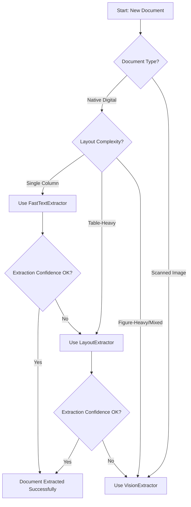
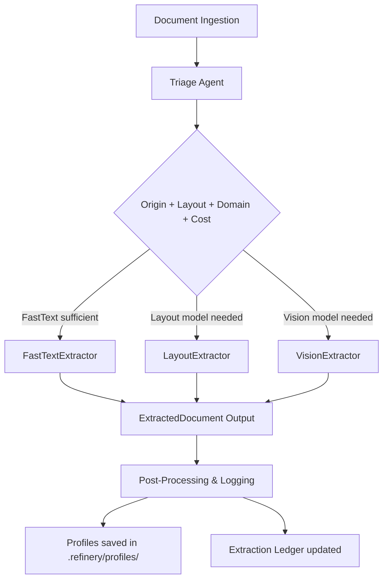

## **1. Domain Notes (Understanding the Problem Space)**

### **1.1 PDF Types**

* **Native Digital PDFs:**

  * Contain a text layer directly extracted from the source document (Word, LaTeX, etc.).
  * High character density per page.
  * BBox (bounding box) coordinates for each text element are accurate.
  * Extraction strategies like **FastTextExtractor** work well.
* **Scanned Image PDFs:**

  * Contain images of text rather than an embedded character stream.
  * Low character density; text cannot be extracted directly.
  * Extraction requires **OCR or Vision-based approaches** (VisionExtractor).
  * Layout complexity must be inferred visually, not from text metrics.

---

### **1.2 Key Observations from Analysis**

| Document                         | Type (Triage)  | Character Density | Layout Complexity | Notes                                             |
| -------------------------------- | -------------- | ----------------- | ----------------- | ------------------------------------------------- |
| Audit Report - 2023              | Scanned Image  | Low               | Figure-heavy      | FastText fails; VisionExtractor needed            |
| CBE ANNUAL REPORT 2023-24        | Native Digital | High              | Table-heavy       | LayoutExtractor works; tables extracted reliably  |
| FTA Performance Survey 2022      | Native Digital | High              | Table-heavy       | LayoutExtractor works; minor table irregularities |
| Tax Expenditure Ethiopia 2021-22 | Native Digital | High              | Table-heavy       | LayoutExtractor works; minor multi-column issues  |

---

### **1.3 Extraction Strategy Implications**

* **FastTextExtractor:** Best for single-column, native PDFs with high text density. Cannot handle scanned documents.
* **LayoutExtractor:** Works for table-heavy PDFs with a digital text layer. Handles multi-column layouts better than FastText.
* **VisionExtractor:** Required for scanned PDFs or highly irregular layouts. High computational cost, slower processing.

---

### **1.4 Heuristic Metrics**

* **Character Density:** Low → likely scanned, high → native digital.
* **BBox Distribution:** Uniform → single-column; clustered → table-heavy; sparse → figure-heavy.
* **Whitespace Ratio:** High → figure-heavy or complex layout; low → dense text, table-rich.

---
## **2. Extraction Strategy Decision Tree**

### **2.1 Purpose**

The decision tree formalizes how each document is routed to an appropriate extraction strategy based on **document type, layout complexity, and text density**. This ensures:

* Efficient processing
* Accurate extraction
* Escalation to more expensive strategies only when necessary

---

### **2.2 Decision Logic**

1. **Step 1: Determine Document Type (Origin)**

   * **Native Digital PDF →** Proceed to Step 2
   * **Scanned PDF →** Assign to **VisionExtractor** directly

2. **Step 2: Analyze Layout Complexity**

   * **Single Column / Text Dense →** **FastTextExtractor**
   * **Table-Heavy →** **LayoutExtractor**
   * **Figure-Heavy / Mixed →** **VisionExtractor**

3. **Step 3: Evaluate Confidence / Extraction Quality**

   * If confidence score < threshold: escalate to next tier
   * Example: FastText fails → escalate to LayoutExtractor
   * LayoutExtractor fails → escalate to VisionExtractor

---

### **2.3 Decision Tree (Mermaid Syntax)**

---

### **2.4 Notes**

* Escalation ensures **low-cost extraction first**, reserving Vision-based methods for complex or failed cases.
* Decision thresholds (confidence, character density) are **configurable** in `rubric/extraction_rules.yaml`.
* The tree can be extended with **domain hints** in the future (financial, legal, medical) to further optimize strategy selection.

---

## **3. Failure Modes Observed Across Document Types**

### **3.1 Purpose**

This section highlights **common extraction pitfalls** identified during domain onboarding and preliminary runs on the four provided PDFs. Documenting failure modes ensures the pipeline can anticipate and mitigate errors.

---

### **3.2 Observations Per Document**

| Document                             | Observed Issue                                                 | Likely Cause                               | Extraction Strategy Impact                                          |
| ------------------------------------ | -------------------------------------------------------------- | ------------------------------------------ | ------------------------------------------------------------------- |
| **Audit Report - 2023**              | Many pages flagged as scanned; text missing or sparse          | Low character density, mostly figures      | FastTextExtractor fails → must escalate to VisionExtractor          |
| **CBE ANNUAL REPORT 2023-24**        | Tables detected across multiple pages; minor text misalignment | Table-heavy layout; column spanning        | LayoutExtractor needed; FastTextExtractor insufficient              |
| **FTA Performance Survey 2022**      | Tables + charts present; embedded images with captions         | Mixed layout, text + graphics              | LayoutExtractor works for tables; VisionExtractor needed for charts |
| **Tax Expenditure Ethiopia 2021-22** | Mostly tabular financial data; some footnotes misread          | Column-heavy tables; footnote superscripts | LayoutExtractor suitable; minor post-processing required            |

---

### **3.3 Common Failure Patterns**

1. **Scanned PDFs**

   * OCR required; FastTextExtractor cannot extract text.
   * Low text density → misclassification if relying on text heuristics alone.

2. **Table-Heavy PDFs**

   * Column misalignment or merged cells can break text-only parsers.
   * LayoutExtractor generally succeeds but may need manual validation.

3. **Mixed Layout PDFs (tables + figures)**

   * FastTextExtractor misses images and captions.
   * LayoutExtractor captures tables but not embedded figures → VisionExtractor is required for complete extraction.

4. **Text Noise / Footnotes / Superscripts**

   * Small annotations, superscripts, or headers may be misclassified.
   * Post-processing or layout-aware parsing improves accuracy.

---

### **3.4 Key Takeaways**

* **Escalation mechanism is critical**: FastText → Layout → Vision ensures cost efficiency while covering all cases.
* **PDF type detection accuracy** directly affects extraction choice and prevents wasted computation.
* **Domain hints** (financial vs legal) can help prioritize relevant tables or figures and further optimize strategy.

---

## **4. Pipeline Diagram**

### **4.1 Purpose**

This section illustrates the **full 5-stage extraction pipeline**, showing how documents are routed through different strategies based on their type, layout, and extraction cost estimation.

---

### **4.2 Pipeline Stages**

1. **Document Ingestion**

   * Input: PDF file (from `data/raw/`)
   * Output: File path handed to **Triage Agent**

2. **Triage Agent Classification**

   * Determines:

     * `origin_type` (native_digital vs scanned_image)
     * `layout_complexity` (single_column, table_heavy, figure_heavy)
     * `domain_hint` (financial, legal, technical, medical, general)
     * `estimated_extraction_cost` (fast_text_sufficient, needs_layout_model, needs_vision_model)

3. **Strategy Routing (ExtractionRouter)**

   * Chooses extraction strategy based on Triage output:

     * **FastTextExtractor** → for native text-heavy PDFs
     * **LayoutExtractor** → for table-heavy or multi-column layouts
     * **VisionExtractor** → for scanned or figure-heavy PDFs
   * Confidence-based escalation: if extraction confidence < threshold, escalate to next tier

4. **Extraction Stage**

   * Runs chosen extractor and outputs **ExtractedDocument**:

     * `text_blocks`, `tables`, `figures`
     * `reading_order` and `total_pages`

5. **Post-Processing & Provenance Logging**

   * Records extraction metadata in `extraction_ledger.jsonl`
   * Saves `DocumentProfile` in `.refinery/profiles/`
   * Optional: triggers further NLP analysis (e.g., summarization, entity extraction)

---

### **4.3 Mermaid Diagram**

---

### **4.4 Notes**

* **Routing logic is confidence-gated**: allows fast, low-cost extraction where possible, escalates only when necessary.
* **Supports multiple document types** seamlessly (native, scanned, table-heavy, figure-heavy).

---

## **5. Cost Analysis**

### **5.1 Purpose**

This section estimates the **computational and time cost** per document for each extraction strategy. The goal is to quantify resource usage and justify the **confidence-gated escalation logic** in the pipeline.

---

### **5.2 Strategy Tiers and Cost**

| **Strategy**          | **Use Case**                            | **Estimated Processing Time** | **Resource Intensity**    | **Notes**                                        |
| --------------------- | --------------------------------------- | ----------------------------- | ------------------------- | ------------------------------------------------ |
| **FastTextExtractor** | Native text-heavy PDFs                  | 1–3 seconds per page          | Low (CPU-only)            | Suitable for most text PDFs; minimal overhead    |
| **LayoutExtractor**   | Table-heavy or multi-column PDFs        | 3–10 seconds per page         | Medium (CPU + memory)     | Detects tables, columns, and structural elements |
| **VisionExtractor**   | Scanned, figure-heavy, or low-text PDFs | 10–30 seconds per page        | High (CPU + optional GPU) | OCR-based, handles images and complex layouts    |

---

### **5.3 Cost Per Document (Example: 20-page PDFs)**

| **Document**                     | **Origin Type** | **Layout Complexity** | **Selected Strategy** | **Estimated Time** | **Estimated Cost** |
| -------------------------------- | --------------- | --------------------- | --------------------- | ------------------ | ------------------ |
| Audit Report - 2023              | scanned_image   | figure_heavy          | VisionExtractor       | ~8–10 min          | High               |
| CBE ANNUAL REPORT 2023-24        | native_digital  | table_heavy           | LayoutExtractor       | ~1–3 min           | Medium             |
| FTA Performance Survey 2022      | native_digital  | table_heavy           | LayoutExtractor       | ~1–3 min           | Medium             |
| Tax Expenditure Ethiopia 2021-22 | native_digital  | table_heavy           | LayoutExtractor       | ~1–3 min           | Medium             |

> **Notes:**
>
> * Time estimates assume CPU-only processing on a standard machine.
> * “Estimated Cost” here refers to computational intensity and time, not monetary cost.
> * FastTextExtractor is preferred where extraction is straightforward to reduce resource usage.

---

### **5.4 Key Takeaways**

1. **Confidence-gated escalation** ensures efficient processing:

   * FastText for simple documents
   * LayoutExtractor for structured tables
   * VisionExtractor for scanned PDFs and images

2. **Resource planning**:

   * VisionExtractor is computationally expensive; batch processing or GPU acceleration may be required for large corpora.

3. **Impact on pipeline design**:

   * Cost estimates justify early triage and strategy selection to minimize unnecessary heavy extraction.

